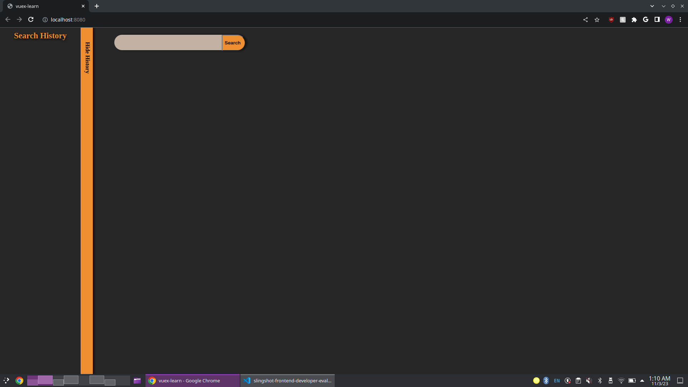
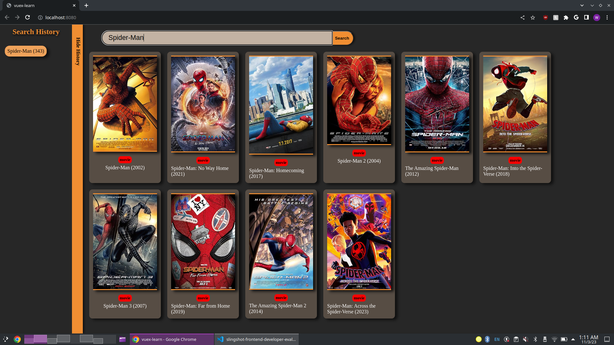
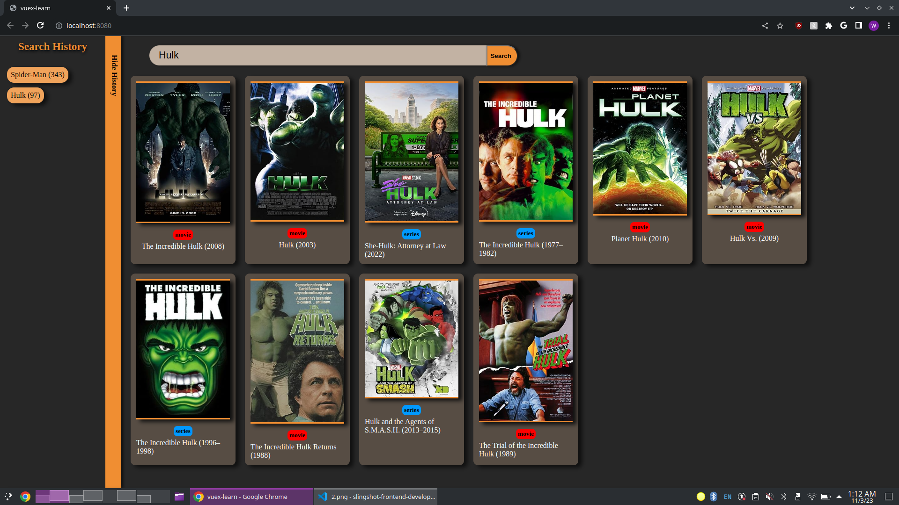
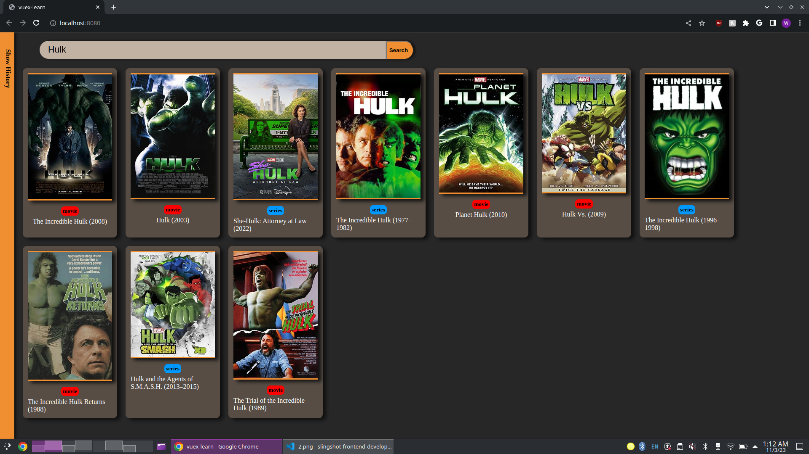
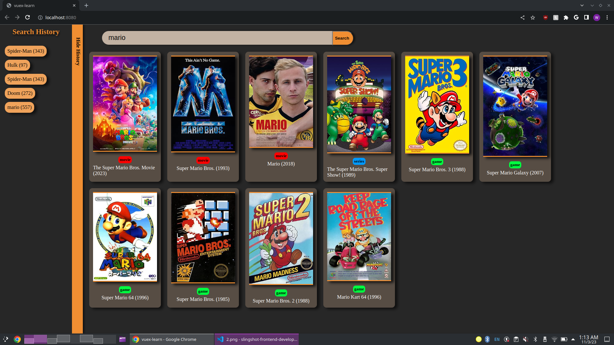

## Build Setup

``` bash
# install dependencies
npm install

# serve with hot reload at localhost:8080
npm run dev

# build for production with minification
npm run build
```

### Opening Screen


### Searching for Media
On the opening screen, you can search for your desired movie or media. Type in your query and either press the "Search" button or hit "Enter" to begin your search.



### Search History
As you perform searches, each search is automatically added to your search history, complete with the corresponding result count.



### Show/Hide Search History
You have the option to show or hide the search history bar. Click on any item in the history to revisit a previous search.



### Media Type Differentiation
Movies, series, and games are color-coded for easy identification, allowing you to distinguish them at a glance.


